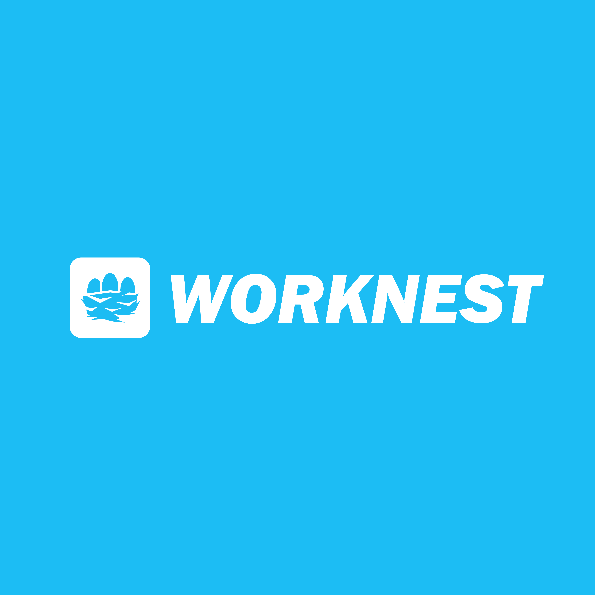

# WorkNest

## 📃 Description
**WorkNest** is a team task management system designed to streamline workflows, track task progress, and improve team collaboration.

## 🚀 Key Features

- 🗂 **Task Management**: Create, update, and track tasks with ease.
- 👥 **Team Collaboration**: Assign tasks to team members and stay informed about their progress.
- 🕒 **Progress Tracking**: Monitor task completion and project timelines.
- 📊 **Dashboard**: Get an overview of the project and team performance.

## 🛠 Technologies Used
- Frontend: React.js
- Backend: Node.js, Express
- Database: MongoDB
- Authentication: JWT

## 📖 How to Use
- Register: Create an account and log in
- Create a Project: Start by creating a new project for your team.
- Add Tasks: Add tasks and assign them to team members.
- Track Progress: Monitor task statuses and deadlines on the dashboard.